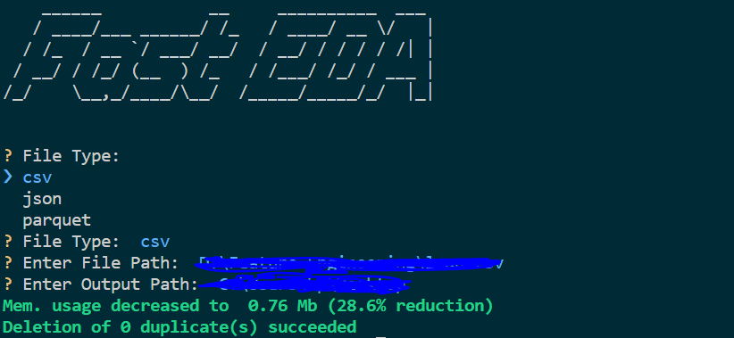
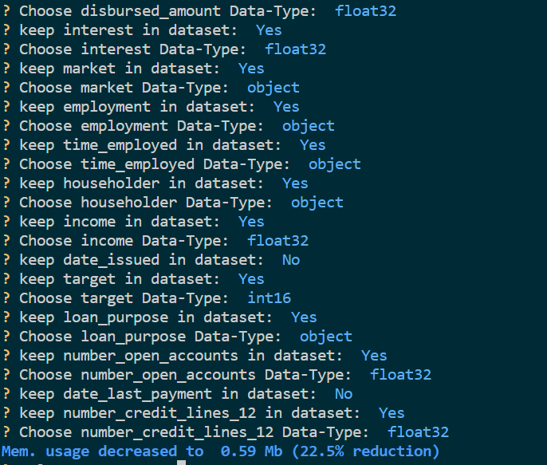
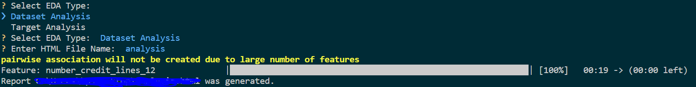

# Fast EDA CLI

## Objective:

Automated Basic Data-Cleaning and Exploratory Data Analysis become crucial and important these days, especially when you start to work on different Data Science/Analysis Project with tight Dead Lines, Using Automated tools to fasten the basic workflow that must be done during development process becomes important.

now alot of tools, softwares and platforms started to create automated applications to help data scientists/analysts to focus on thier target and finish the development process in a very short time.

## Description:

This Project Uses SweetViz API to create Automated EDA Reports with the help of some CLI modules to create a basic CLI Application.

## Technologies & Prerequisites:

- Python 3.10
- poetry
- EDA Knowledge
- Git & Make Command for Windows OS

## Project Setup:

all of what you need to setup the dependancies, and of course after setting up [poetry](https://python-poetry.org/docs/) on you machine is to run the following commands 
```bash
make install
```
this will create the virtual environment, and install python dependancies needed for this project, and if you want to remove the environment, you can run the following command
```bash
poetry env remove <env-name>
```

## How it Works?

using this simple command you can start the CLI, just make sure that you have git on windows and search for how to install make command
```bash
make run
```
after running the command your terminal will show the following list to choose the file format, the path of the file and where to generate the output HTML file on your machine

then ask to keep/remove features, and adjust data-types of features

last part to choos the type of analysis, and HTML file name
